# 加速試験ランクD予測モデルの多角的検証レポート

## 1. 概要

本レポートでは、パナソニック社内MLコンペデータセットを用いて加速試験の結果がランクDとなるかどうかを予測する二値分類モデル（Boosted Decision Tree / ロジスティック回帰）を構築し、BCG FACETライブラリを用いて多角的に検証した結果を報告する。

### データ構成

```
+-------------------+     +------------------+     +------------------+
|   train.csv       |     |  machine_log.csv |     |   test.csv       |
|   50,000 products |---->|  2,400,000 rows  |<----|  100,000 products|
|   (rank A-D付き)   |     |  20 steps/batch  |     |  (rank無し)       |
+-------------------+     +------------------+     +------------------+
        |                         |                         |
        |  結合キー: (line, batch_count)                       |
        v                         v                         v
+---------------------------------------------------------------+
|  特徴量: line, batch_count, tray_no, position,                  |
|          maintenance_count,                                    |
|          temperature_{1,2,3}_{mean,std,min,max},               |
|          pressure_{mean,std,min,max}                           |
|  計 21 特徴量                                                   |
+---------------------------------------------------------------+
```

目的変数: `rank == "D"` (D=1, その他=0)。テストデータの正解は `ground_truth.csv` で評価。

---

## 2. モデル性能比較

| モデル | Accuracy | AUC |
|--------|----------|-----|
| **Boosted Decision Tree (XGBoost)** | 0.8387 | **0.7936** |
| **ロジスティック回帰** | **0.8522** | 0.6793 |

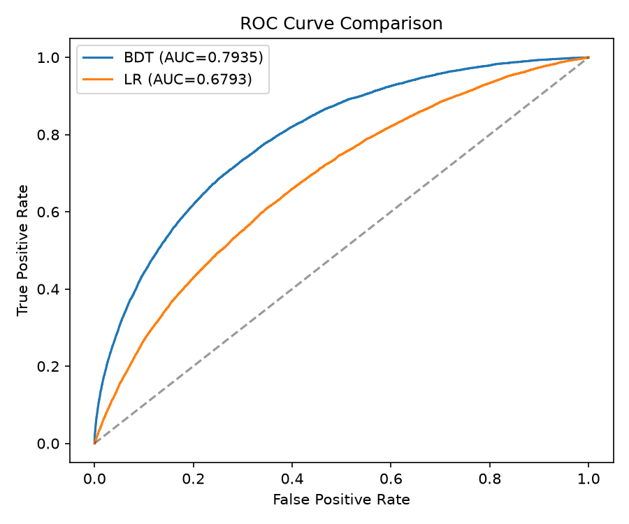

### 解釈

```
                           Accuracy-AUC トレードオフ

      AUC
    0.80 |  * BDT
         |
    0.75 |
         |
    0.70 |
         |                              * LR
    0.65 |
         +------+------+------+------+------
              0.83   0.84   0.85   0.86
                        Accuracy
```

- **ロジスティック回帰**はAccuracyが高い（0.852）が、AUCが低い（0.679）。これはクラス不均衡（D率 ≈ 14.8%）の下で「全て非D」と予測する方向にバイアスされやすいことを示す。
- **BDT**はAccuracyでは劣るが、AUCが大幅に高い（0.794）。陽性・陰性の識別能力がBDTの方が優れている。

### 混同行列

| | BDT | LR |
|---|---|---|
| 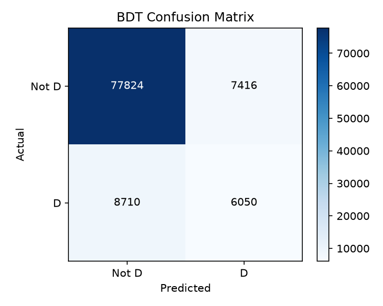 | 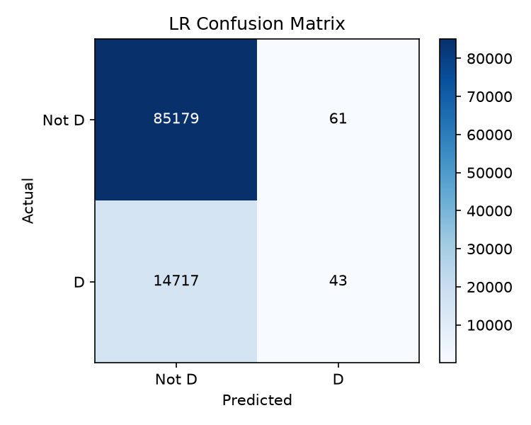 |

---

## 3. FACET Feature Inspection

> **注記**: FACET検証にはsklearn `GradientBoostingClassifier` を使用している（XGBoostはFACETのSHAP interaction値フォーマットと非互換のため）。ハイパーパラメータ（`n_estimators=300, max_depth=6, learning_rate=0.1, subsample=0.8`）は`train.py`のXGBoostモデルと統一している。両者は同じ勾配ブースティング決定木アルゴリズムの実装であり、分析結果の傾向は実質的に同等と考えてよい。

### 3.1 SHAP特徴量重要度

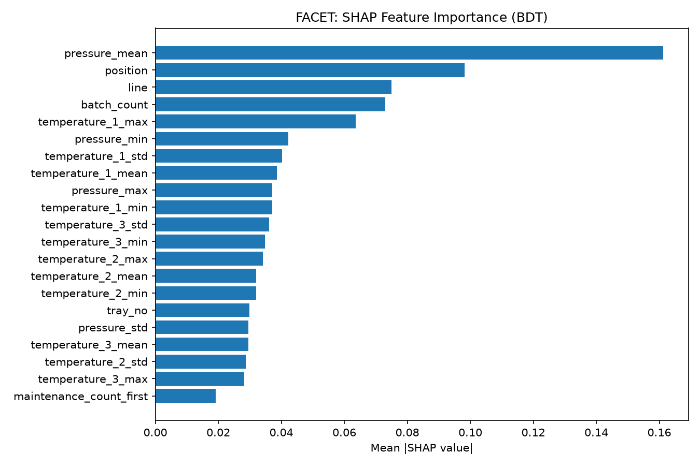

**主要な発見:**
- `pressure_mean`（圧力平均値）が最も重要な特徴量（SHAP値 = 0.167）
- `position`（トレイ内位置）と`line`（製造ライン）が続く
- 温度センサーの各統計量は個別には中程度の寄与だが、合計では大きな影響力を持つ
- `maintenance_count`は最も重要度が低い

```
特徴量重要度の階層構造:

  pressure_mean     ████████████████████████████  0.167  ← 最重要
  position          ██████████████████            0.095
  line              █████████████████             0.089
  batch_count       ██████████████                0.073
  temperature_1_max ███████████                   0.059
  temperature_3_std █████████                     0.043
  ...               ...
  maint_count_first ██                            0.010  ← 最小
```

### 3.2 特徴量シナジーマトリックス

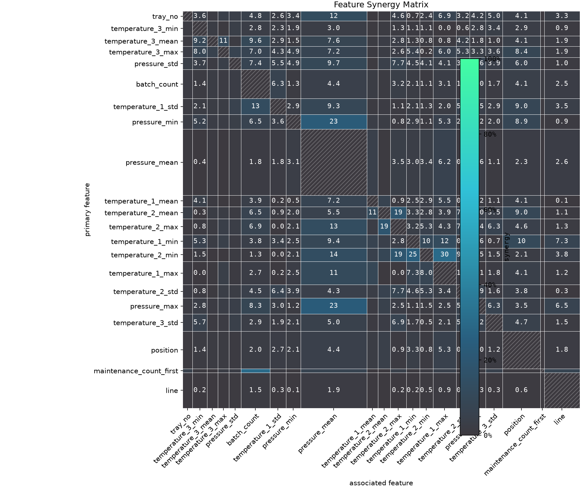

シナジーは「2つの特徴量がモデル予測に対してどの程度相互依存しているか」を示す。

**主要な発見:**
- `temperature_2_min` と `temperature_1_max` の間に最大30%のシナジーが存在
- 温度センサー間には広くシナジーが存在（温度測定値は物理的に相関し、組み合わせることで追加の情報を得る）
- `pressure_mean`は他の特徴量との間に比較的低いシナジー（≤ 6.2%） → **自律的な特徴量**
- `pressure_min`と`pressure_mean`の間に23%のシナジー → 圧力の絶対値と最小値は相互補完的

### 3.3 特徴量冗長性マトリックス

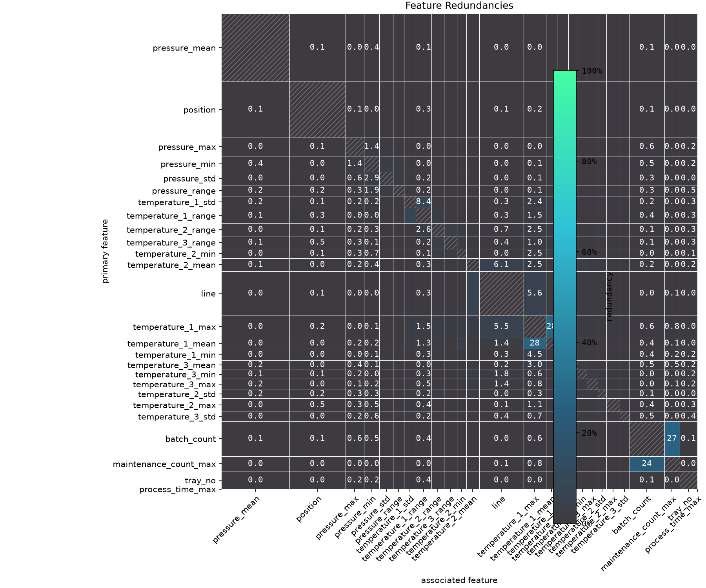

冗長性は「ある特徴量がモデル予測に対して他の特徴量と重複する情報をどの程度持つか」を示す。

**主要な発見:**
- `temperature_1_mean` と `temperature_1_max` の間に最大24%の冗長性
- `temperature_2_mean` と `temperature_1_max` の間に15%の冗長性
- 温度センサー群は相互に冗長 → 特徴量削減の余地がある
- `pressure_mean`、`position`、`line`は他の特徴量との冗長性が低い → **独立した情報源**

### 3.4 デンドログラム

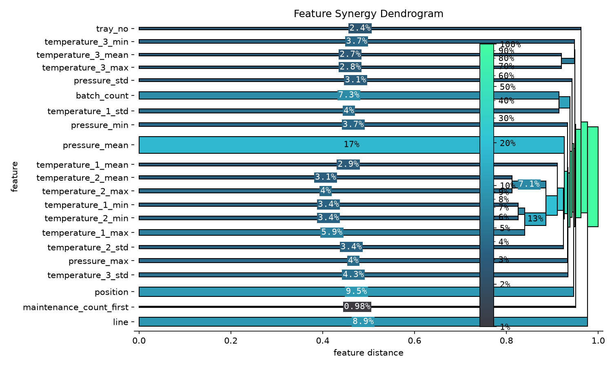
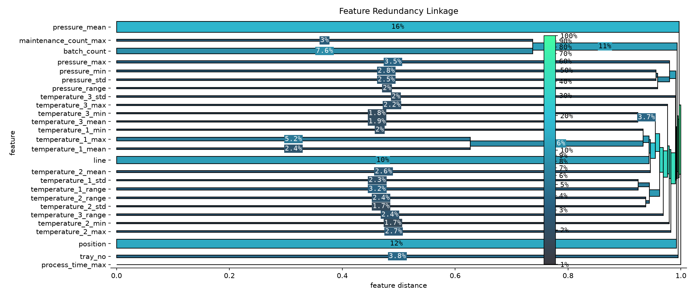

デンドログラムから以下のクラスターが読み取れる:

```
冗長性クラスター:
  ┌─ temperature_1_mean
  ├─ temperature_1_max    ─┐
  ├─ temperature_1_min     │ 高い相互冗長性
  ├─ temperature_2_mean   ─┘
  │
  ├─ temperature_2_min
  ├─ temperature_2_max    ─┐ 中程度の冗長性
  ├─ temperature_2_std    ─┘
  │
  ├─ pressure_mean        ← 独立
  ├─ position             ← 独立
  └─ line                 ← 独立
```

### 3.5 特徴量相互作用・アソシエーション

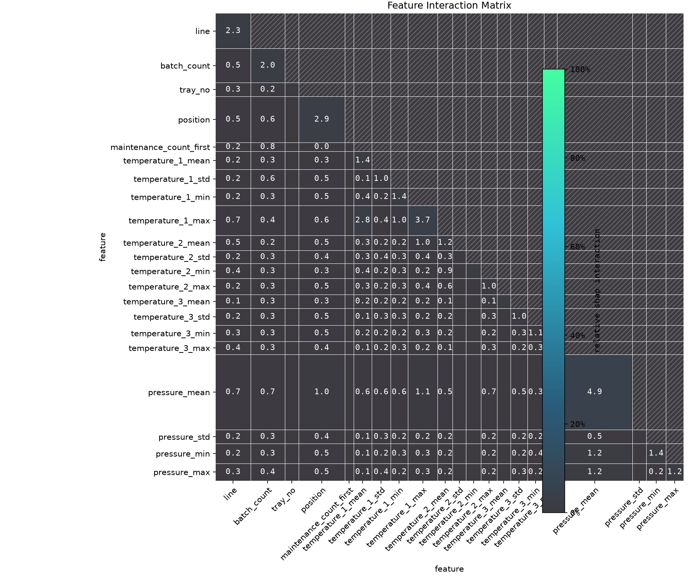
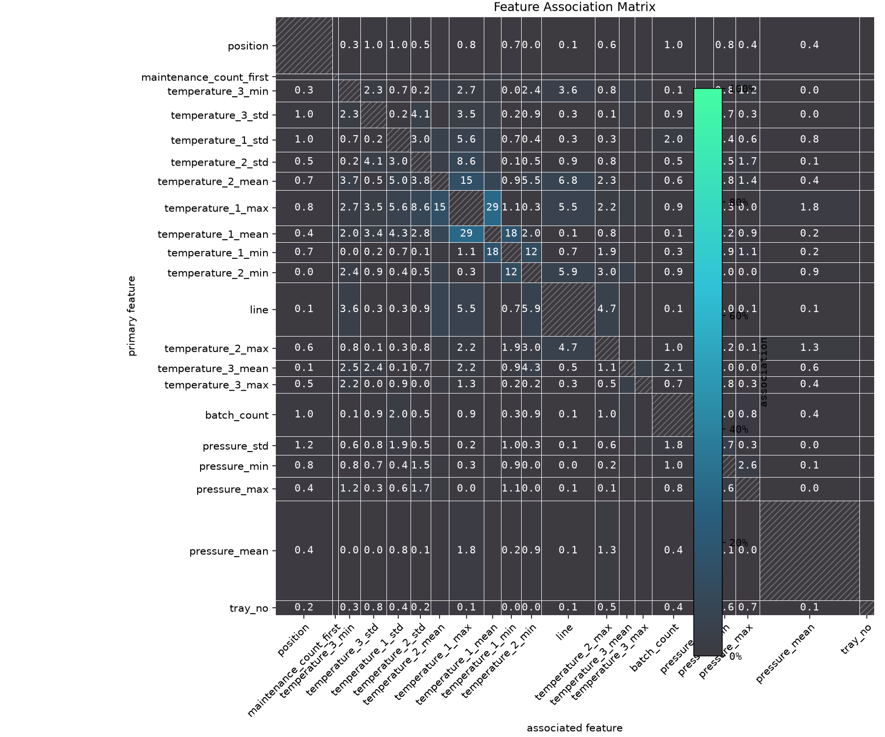

---

## 4. 単変量確率シミュレーション

FACETのUnivariateProbabilitySimulatorを用いて、各主要特徴量の値がランクD確率に与える影響をシミュレーションした。

### 4.1 pressure_mean（圧力平均値）

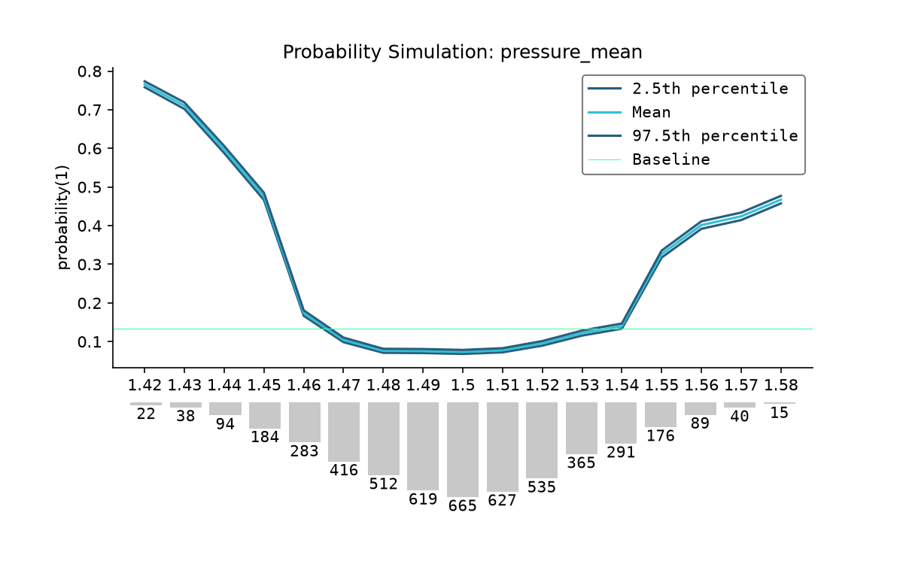

- 圧力が1.48〜1.50 Pa付近で最も低いD確率（≈ 8%）
- 圧力が1.42以下または1.55以上で急激にD確率上昇（最大70%）
- **U字型の関係** → 最適な圧力レンジが存在し、そこからの逸脱がランクD発生の主因

```
D確率
0.7 |*                                    *  *  *
    |  *                              *
0.5 |     *                        *
    |       *                   *
0.3 |         *              *
    |           *          *
0.1 |             *  *  *
    +---+---+---+---+---+---+---+---+---+
      1.42  1.44  1.46  1.48  1.50  1.52  1.54  1.56  1.58
                       pressure_mean (Pa)
```

### 4.2 position（トレイ内位置）

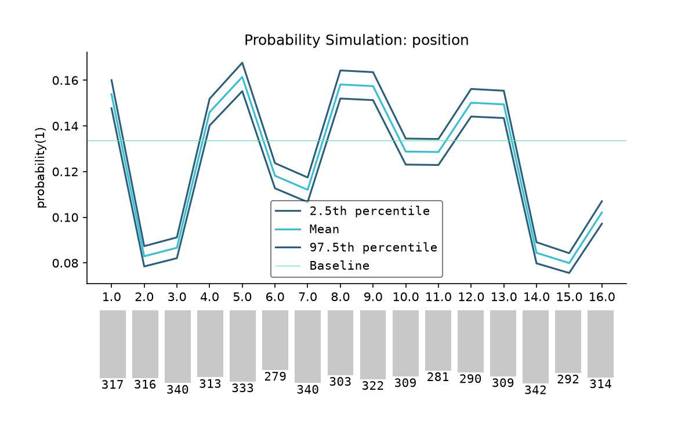

- 位置番号によるD確率の変動が見られる

### 4.3 line（製造ライン）

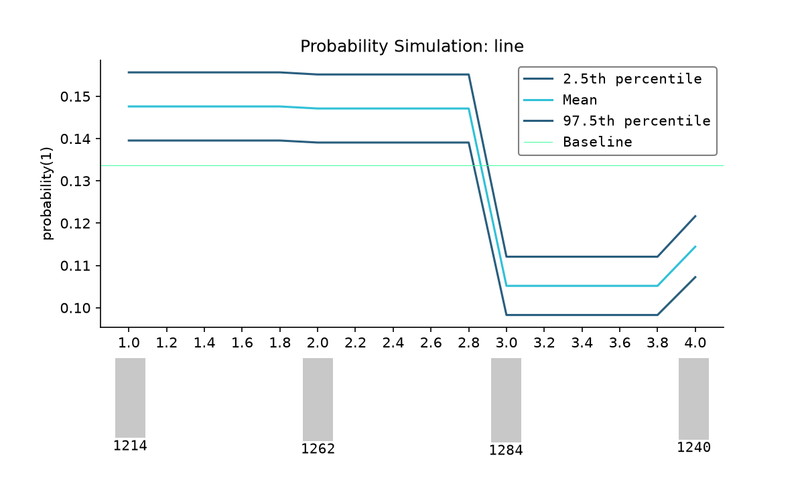

- ラインによるD確率の差異が確認できる

### 4.4 batch_count

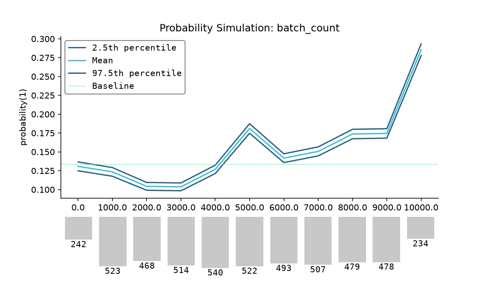

- バッチ番号の増加に伴うD確率の変動パターン

### 4.5 temperature_1_max

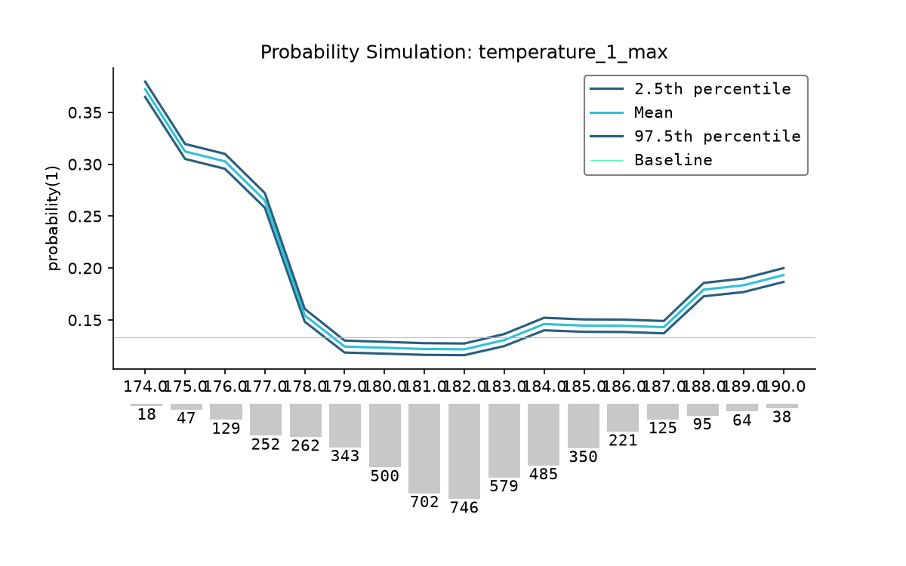

- 温度最大値との関連性

---

## 5. モデルの安定性（ロバストネス）分析

### 5.1 ブートストラップ交差検証

50回のブートストラップサンプリングによる安定性評価:

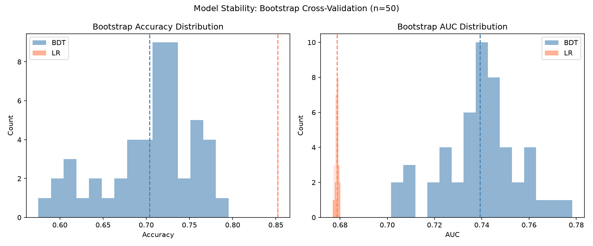

| メトリクス | モデル | 平均 | 標準偏差 | 最小 | 最大 |
|-----------|--------|------|---------|------|------|
| Accuracy | BDT | 0.704 | **0.0523** | 0.575 | 0.795 |
| Accuracy | LR | 0.852 | 0.0001 | 0.852 | 0.852 |
| AUC | BDT | 0.739 | **0.0164** | 0.702 | 0.778 |
| AUC | LR | 0.679 | 0.0007 | 0.677 | 0.680 |

```
安定性の比較 (標準偏差):

          BDT                    LR
  Accuracy: ========== 0.0523  Accuracy: | 0.0001
  AUC:      ===== 0.0164       AUC:      | 0.0007

  |--------|--------|          |--------|--------|
  0       0.03    0.06        0       0.01    0.03

  BDT = 変動大 (高感度)       LR = 変動小 (安定)
```

### 5.2 層化K分割交差検証

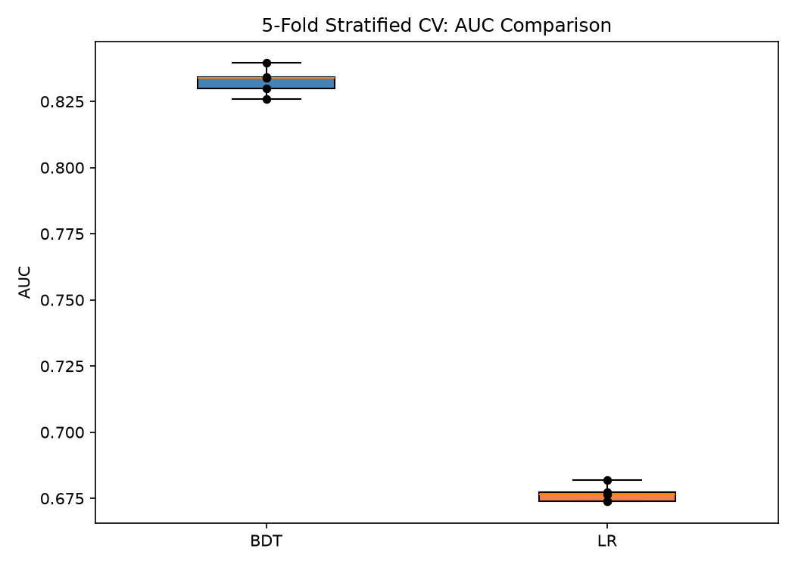

- **BDT**: 5-fold AUC = 0.833 ± 0.005
- **LR**:  5-fold AUC = 0.677 ± 0.003

---

## 6. ロバストネスに関する総合的示唆

### 6.1 BDT vs LR: ロバストネス特性

```
            ┌─────────────────────────────────────────────┐
            │        モデル特性の比較                        │
            ├──────────┬──────────────┬──────────────────┤
            │          │     BDT      │       LR         │
            ├──────────┼──────────────┼──────────────────┤
            │ AUC      │ 0.794 (高)   │ 0.679 (低)       │
            │ Accuracy │ 0.839 (中)   │ 0.852 (高)       │
            │ 安定性    │ σ=0.016 (低) │ σ=0.001 (高)     │
            │ 非線形性  │ 捕捉可能     │ 捕捉不可          │
            │ 過学習    │ リスクあり    │ リスク低          │
            └──────────┴──────────────┴──────────────────┘
```

### 6.2 主要な知見

1. **BDTの識別能力は優れるが安定性に課題がある**
   - AUCはLRを0.115ポイント上回るが、ブートストラップ標準偏差が22倍大きい（0.016 vs 0.001）
   - 訓練データのサンプリング変動に敏感 → 汎化性能にばらつきが生じやすい

2. **LRは安定だが識別能力に限界がある**
   - Accuracyが高いのはクラス不均衡による見かけ上の効果が大きい
   - AUCが0.68と低く、ランクD品の検出力が不十分
   - 圧力のU字型関係などの非線形パターンを捉えられない

3. **pressure_meanが最もロバストな予測因子**
   - SHAP重要度で突出（0.167）
   - 他の特徴量との冗長性が低い（独立した情報源）
   - 他の特徴量とのシナジーも低い（自律的に機能）
   - 物理的に解釈可能なU字型関係を持つ

4. **温度特徴量群には冗長性がある**
   - temperature_1の各統計量間で最大24%の冗長性
   - 特徴量削減（例：PCA）によりモデルの安定性を改善できる可能性
   - ただし温度センサー間のシナジーも存在するため、単純な削除は避けるべき

5. **製造条件（line, position）は独立した予測情報を持つ**
   - 冗長性が低く、固有の情報を提供
   - 製造ラインや位置による品質差が実在することを示唆

### 6.3 実運用へのロバストネス改善提案

```
改善アプローチ:

  [現状のBDT]
      │
      ├──→ (1) 正則化の強化 (max_depth↓, min_child_weight↑)
      │        → 過学習の軽減、安定性の向上
      │
      ├──→ (2) 特徴量エンジニアリング
      │        → 冗長な温度特徴量をPCAで集約
      │        → pressure_meanの二乗項を追加（U字型対応）
      │
      ├──→ (3) アンサンブル (BDT + LR)
      │        → BDTの識別力 + LRの安定性を兼備
      │
      └──→ (4) キャリブレーション
               → 確率出力の信頼性を向上
```

---

## 7. 結論

- **BDT**は識別能力が高いが、訓練データへの感度が高く安定性に課題がある
- **LR**は安定だが、非線形関係を捉えられず識別能力が制限される
- **pressure_mean**が最もロバストかつ重要な予測因子であり、圧力管理の最適化がランクD削減に直結する
- 実運用には、BDTの正則化強化と特徴量の冗長性削減によるロバストネス改善、もしくはアンサンブルモデルの採用を推奨する

---

*本レポートは BCG FACET 2.2.2 を用いて生成されました。*
