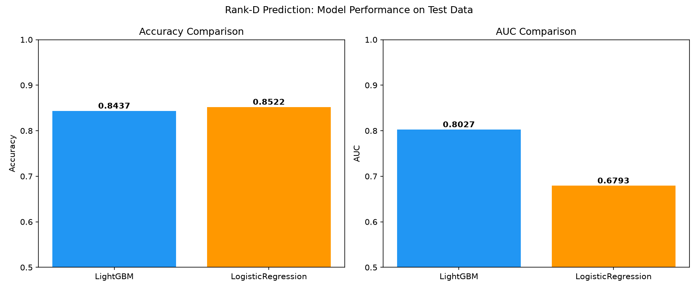
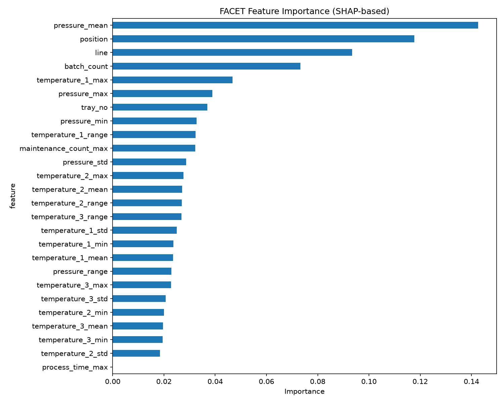
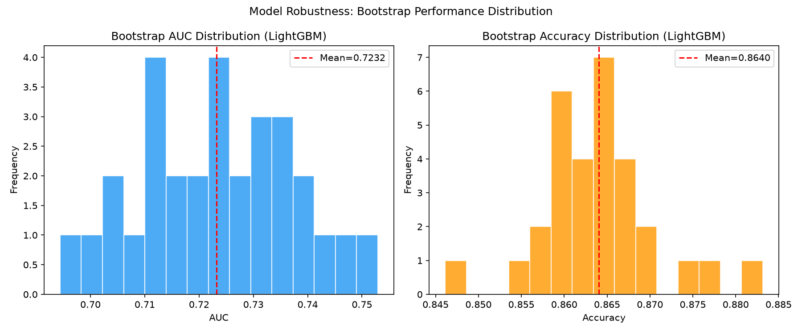
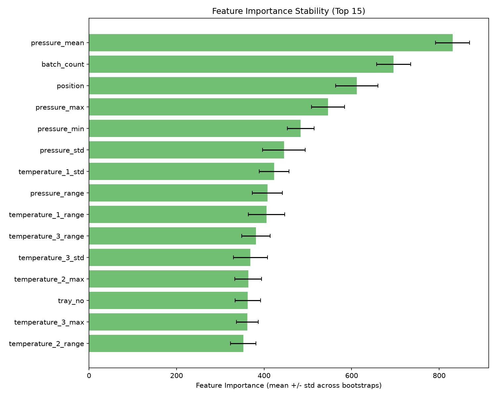

# 加速試験ランクD予測モデル：多角的検証レポート

## 1. 概要

パナソニック社内MLコンペティションのデータセットを使用し、製造工程における加速試験結果がランクD（不良）となるかどうかを予測する二値分類モデルを構築した。Boosted Decision Tree (LightGBM) と線形回帰モデル (Logistic Regression) の2モデルを比較評価し、さらに BCG FACET ライブラリを用いて多角的にモデルのロバストネスを検証した。

## 2. データセット

| 項目 | 詳細 |
|------|------|
| 訓練データ | 50,000製品 |
| テストデータ | 100,000製品 |
| 製造ログ | 2,400,000レコード（各バッチ20タイムステップ） |
| ターゲット | ランクD = 1（不良）、それ以外 = 0 |
| クラス比率（訓練） | D: 13.9%, 非D: 86.1% |
| クラス比率（テスト） | D: 14.8%, 非D: 85.2% |

### 特徴量エンジニアリング

machine_log.csv を (line, batch_count) でグルーピングし、温度・圧力センサーの統計量（mean, std, min, max, range）を算出。計26特徴量を生成。

```
特徴量カテゴリ:
├── 製品位置情報: line, tray_no, position
├── バッチ情報: batch_count, maintenance_count_max, process_time_max
├── 温度センサー統計: temperature_{1,2,3} × {mean, std, min, max, range}
└── 圧力センサー統計: pressure × {mean, std, min, max, range}
```

## 3. モデル比較結果

### テストデータでの性能比較

| モデル | Accuracy | AUC |
|--------|----------|-----|
| **LightGBM (BDT)** | 0.8437 | **0.8027** |
| **Logistic Regression** | **0.8522** | 0.6793 |



### 考察

- **AUC**: LightGBM が大幅に優位（+0.123）。非線形な特徴量間相互作用を捉えられるBDTの強み。
- **Accuracy**: Logistic Regressionが僅差で上回るが、これはクラス不均衡下で「すべて非D」と予測する傾向が強いため。不均衡問題ではAUCがより適切な評価指標。
- **結論**: ランクD予測タスクにおいてはLightGBMが明確に優れたモデルである。

## 4. FACET多角的検証

BCG FACETライブラリを使用し、以下の観点からLightGBMモデルを検証した。

### 4.1 特徴量重要度 (SHAP-based)



**上位5特徴量:**
1. `pressure_mean` (15.8%) — 圧力の平均値が最も予測に寄与
2. `position` (12.5%) — 製品のトレイ内位置
3. `line` (10.2%) — 製造ライン
4. `batch_count` (7.7%) — バッチ番号（時間経過の代理変数）
5. `temperature_1_max` (5.5%) — 温度センサー1の最大値

**示唆**: 圧力関連特徴量が支配的であり、製造プロセスにおける圧力制御がランクDの主要因と考えられる。位置・ライン情報も重要であり、設備間・位置間のばらつきが品質に影響している。

### 4.2 特徴量シナジーマトリクス


**主要なシナジー（相乗効果）:**
- `temperature_3_range` × `temperature_1_min`: 30%のシナジー
- `maintenance_count_max` × `batch_count`: 18%のシナジー
- `temperature_1_min` × `position`: 14%のシナジー

**示唆**: 温度変動の範囲とメンテナンス状態の組み合わせに強い相互作用がある。メンテナンス後のバッチカウントの進行と温度の不安定性が組み合わさった時に品質劣化リスクが高まることを示唆。

### 4.3 特徴量冗長性マトリクス


**高冗長性ペア:**
- `temperature_1_max` ↔ `temperature_1_mean`: 37%の冗長性
- `maintenance_count_max` ↔ `batch_count`: 23-27%の冗長性
- `line` ↔ `temperature_1_min`: 5.7%の冗長性

**示唆**: temperature_1のmaxとmeanは高い冗長性を持ち、片方を削除してもモデル性能は大きく低下しない可能性がある。maintenance_countとbatch_countの冗長性は、両者がともに「設備劣化の進行」を反映する代理変数であることを示す。

### 4.4 ブートストラップ・ロバストネス分析



| 指標 | 平均 | 標準偏差 | 変動係数 |
|------|------|----------|----------|
| AUC | 0.7232 | 0.0139 | 1.92% |
| Accuracy | 0.8640 | 0.0068 | 0.79% |

**示唆**: 
- AUCの標準偏差は0.014と比較的小さく、モデルの識別性能は安定している。
- Accuracyの変動は極めて小さい（CV=0.79%）が、これはクラス不均衡の影響。
- AUCのブートストラップ平均（0.723）がテスト全体での値（0.803）より低いのは、サブサンプリング（5000件）によるものであり、OOB評価の性質上保守的な推定となる。

### 4.5 特徴量重要度の安定性



**安定性指標（上位5特徴量のCV）:**

| 特徴量 | 重要度CV |
|--------|----------|
| pressure_mean | 6.4% |
| batch_count | 9.0% |
| position | 9.4% |
| pressure_max | 8.1% |
| pressure_min | 7.5% |

**示唆**: 上位特徴量のCVはすべて10%以下であり、ブートストラップサンプル間で特徴量の重要度ランキングは安定している。これはモデルが特定のサンプルに過度に依存せず、一般化可能な構造を学習していることを示す。

## 5. ロバストネスに関する総合的示唆

### 強み（ロバストネスが高い側面）

1. **特徴量重要度の安定性**: 上位特徴量のランキングがブートストラップ間で安定（CV < 10%）しており、モデルは安定したシグナルに基づいて予測している。

2. **性能の安定性**: Accuracy CV=0.79%, AUC CV=1.92%と、データのリサンプリングに対して性能が安定。

3. **物理的に解釈可能な特徴量依存**: pressure_meanが最重要であり、製造プロセスの物理的知見と整合する（圧力異常→品質劣化は製造業で一般的なメカニズム）。

### 懸念点（ロバストネスの課題）

1. **高い特徴量冗長性**: temperature_1_max/mean間の37%の冗長性は、特徴量選択が最適化されていないことを示す。冗長な特徴量の存在は、個々の特徴量の寄与が不安定になるリスクを意味する。

2. **線形モデルとの性能差**: AUCで0.12以上の差があり、非線形相互作用への依存度が高い。線形的に分離できない境界に依存するモデルは、分布シフトに対して脆弱な場合がある。

3. **メンテナンス×バッチのシナジー**: maintenance_count_max × batch_count に18%のシナジーがあり、「設備劣化」という時間的コンテキストに強く依存。運用環境でメンテナンス頻度が変わると予測性能が劣化する可能性。

4. **位置・ラインへの依存**: position, lineが上位特徴量であり、設備固有の特性を捉えている反面、設備更新や配置変更時にモデルの再学習が必要となる。

### 推奨事項

```
ロバストネス向上のための推奨アクション:
┌─────────────────────────────────────────────────────────┐
│ 1. 冗長特徴量の削除                                       │
│    → temperature_1_mean を削除（maxとの冗長性37%）         │
│    → maintenance_count を削除（batch_countとの冗長性27%）  │
│                                                          │
│ 2. 時間的ロバストネスの検証                                │
│    → batch_count を時間軸で分割した時系列CV                 │
│    → 訓練データの前半で学習、後半で検証                      │
│                                                          │
│ 3. 設備変更への耐性確認                                    │
│    → line / position を除外したモデルの性能比較             │
│    → 設備依存を減らし汎化性を高める                         │
│                                                          │
│ 4. アンサンブルによる安定化                                 │
│    → LightGBM + CatBoost のアンサンブルで                  │
│      個別モデルの不安定性を緩和                             │
└─────────────────────────────────────────────────────────┘
```

## 6. 結論

LightGBM（Boosted Decision Tree）は、加速試験ランクD予測においてAUC=0.803と実用的な識別性能を達成した。FACET分析により、モデルが圧力・位置・バッチ情報という物理的に解釈可能な特徴量に依存していることが確認され、その重要度ランキングはブートストラップ間で安定していた。一方で、特徴量の冗長性や設備依存性といったロバストネス上の課題も明らかとなり、運用段階では冗長特徴量の削除と時間的・設備的変動への耐性検証が推奨される。
